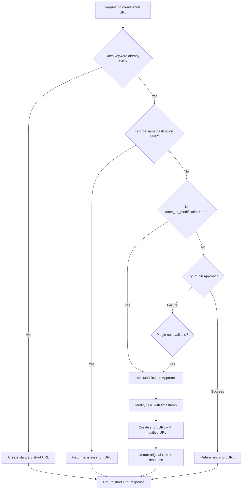

# Duplicate URL Handling: Decision Flow

> **Version:** 1.2.0 | **Last Updated:** May 2025 | **Compatibility:** YOURLS 1.7+, 1.8+, 1.9.2+

This document provides a visual representation of how YOURLS-MCP decides which approach to use when creating duplicate URLs, along with detailed explanations of each step in the process.

## Flowchart

The following flowchart illustrates the decision-making process for handling duplicate URL requests:

## Detailed Explanation of Each Step

### 1. Initial Request
When a request comes in to create a short URL with a specific keyword, YOURLS-MCP first checks if the keyword is available.

### 2. Keyword Availability Check
- If the keyword is available (doesn't exist in the database), YOURLS-MCP creates a standard short URL.
- If the keyword already exists, additional checks are needed.

### 3. Duplicate URL Check
If the keyword exists, YOURLS-MCP checks whether the requested destination URL is the same as the one already associated with this keyword:
- If it's the same URL, the existing short URL is returned (no need to create a duplicate).
- If it's a different URL, this is a true duplicate URL request requiring special handling.

### 4. Approach Selection
- If `force_url_modification=true` was specified in the request, YOURLS-MCP skips the plugin approach and directly uses URL modification.
- Otherwise, it first attempts to use the plugin approach.

### 5. Plugin Approach
- YOURLS-MCP calls the YOURLS API with the `force=1` parameter to signal the Force Allow Duplicates plugin.
- If successful, a new short URL is created with the original destination URL and requested keyword.
- If unsuccessful (plugin not installed or not activated), YOURLS-MCP falls back to the URL modification approach.

### 6. URL Modification Approach
- YOURLS-MCP modifies the destination URL by adding a timestamp parameter.
- It creates a short URL with this modified URL.
- In the response, it includes the original URL instead of the modified one for better user experience.

### 7. Response
- The final response includes the short URL, original destination URL, and other metadata.
- The response follows a consistent format regardless of which approach was used.

## Implementation Notes

### API Request Flow
1. Client calls `createCustomUrl(url, keyword, title, format, forceUrlModification)`
2. `createCustomUrl` checks if `forceUrlModification` is true
3. If not, it tries the plugin approach first with `tryPluginApproach(client, url, keyword, title)`
4. If the plugin approach fails, it falls back to `tryUrlModificationApproach(client, url, keyword, title)`
5. Results are processed and normalized before returning to the client

### Error Handling
- Both approaches include proper error handling and validation
- Network errors, authentication issues, and API errors are all handled appropriately
- If both approaches fail, a proper error response is returned

## When to Use Each Approach

### Plugin Approach (Preferred)
- When you have administrative access to the YOURLS installation
- When you want true duplicates without any URL modification
- For applications requiring strict URL preservation

### URL Modification Approach
- When you don't have access to install plugins
- When working with YOURLS instances you don't control
- As a fallback when the plugin is not available
- When explicitly requested via `force_url_modification=true`